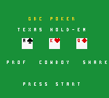
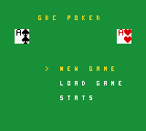
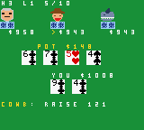
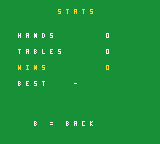

# GBC Poker — Texas Hold'em for Game Boy Color

A full No-Limit Texas Hold'em tournament against three AI opponents, built for
Game Boy Color with GBDK-2020. Compiles to a `.gbc` ROM that runs on emulators
and on handhelds like the R36S (ArkOS, `roms/gbc`).

 
 

## Features

- **Correct poker engine** — histogram hand evaluator (no per-hand `malloc`,
  recursion, or float), full betting with min-raise reopening, and real
  **side-pot** splitting for multi-way all-ins, including odd-chip distribution.
- **Three AI personalities with portraits** — the tight-passive *Professor*,
  loose-aggressive *Cowboy*, and balanced *Shark*, each with its own aggression /
  looseness / bluff parameters, light opponent modelling, and a hand-drawn
  16×16 avatar at its seat.
- **Graphical CGB table** — green felt, bold red/black card faces, face-down
  backs, and per-tile palettes, rendered from compact hand-built tilesets.
- **Menus & save/load** — a main menu (New Game / Load Game / Stats); an in-game
  menu (SELECT) to save or quit to the menu; the tournament resumes from SRAM.
- **Tournament mode** — rising blinds, elimination, champion / bust-out screens.
- **Stats** — hands played, tournaments, championships, and best hand persist in
  SRAM and are shown on the Stats screen.
- **APU sound** — deal ticks, chip clinks, and short win/lose/title jingles
  across the GB sound channels ([src/sound.c](src/sound.c)).

## Toolchain

The build needs GBDK-2020 in `tools/gbdk` (not committed — it's platform-specific
binaries). Fetch it with:

```sh
make toolchain            # defaults to the macOS arm64 release
```

For another platform, pass the matching asset from the
[GBDK-2020 releases](https://github.com/gbdk-2020/gbdk-2020/releases):

```sh
make toolchain GBDK_URL=https://github.com/gbdk-2020/gbdk-2020/releases/download/4.5.0/gbdk-linux64.tar.gz
```

## Build

```sh
make test    # native unit tests (host gcc) — engine + AI, no emulator needed
make rom     # build build/gbc-poker.gbc
make run     # launch in Emulicious / SameBoy / OpenEmu if installed
make clean
```

Copy `build/gbc-poker.gbc` to your R36S under `roms/gbc` to play on hardware.

## Testing

All game logic lives in pure C (`deck`, `eval`, `game`, `ai`) with no GBDK
dependency, so it compiles and runs natively. `make test` runs:

- table cases for all nine hand categories (wheel and steel-wheel included);
- kicker / tie-break comparisons, including three-pair and double-trips;
- a **1,000,000-hand cross-check** of the fast evaluator against a brute-force
  C(7,5) reference — zero mismatches;
- side-pot scenarios with two and three unequal all-ins, and odd-chip splits;
- a **20,000-hand random-action fuzz** and a 2,000-hand all-AI run, both
  asserting chip conservation and that every betting round terminates.

## Layout

```
src/
  cards.h    card encoding (suit<<4 | rank)
  rand.c/.h  16-bit xorshift PRNG + entropy mixing
  deck.c/.h  52-card deck, Fisher-Yates shuffle
  eval.c/.h  7-card hand evaluator -> 32-bit comparable strength
  game.c/.h  betting state machine, blinds, side pots, showdown
  ai.c/.h    opponent decision logic and personas
  ui.c/.h    CGB background renderer (felt, cards, portraits, menus)
  sound.c/.h APU sound effects and jingles
  carddata.* card + font tiles, bank 1 (see assets/gen_cards.py)
  fontmap.c  ASCII->glyph map, kept in the home bank for text draws
  portraits.* persona avatars, bank 1 (see assets/gen_portraits.py)
  text.c/.h  card / name strings
  save.c/.h  SRAM persistence: stats + resumable game slot
  main.c     menu loop, tournament, save/load wiring
tests/
  test_eval.c  native test suite
assets/
  gen_cards.py     generates src/carddata.{c,h} + src/fontmap.c
  gen_portraits.py generates src/portraits.{c,h}
```

## Controls

- **Menus** — Up/Down to move, **A** to select, **B/Select** to cancel
- **Start** — begin from the title splash
- **D-pad Left/Right** — move between Fold / Check-Call / Raise
- **A** — confirm; in the raise sub-menu, **Up/Down** adjust the amount
- **B** — jump to Fold (or back out of the raise sub-menu)
- **Select** (in a hand) — open the in-game menu (Save / Quit to menu)

## Hardware notes

CGB-only ROM (`MBC5+RAM+Battery`, 64 KB / 4 banks). Bulk tile/portrait data
lives in bank 1 so the home bank keeps room for code (home ~94%, bank 1 ~8%).
All arithmetic is 8/16-bit; division and modulo are confined to non-hot UI code.

## License

MIT — see [LICENSE](LICENSE).
